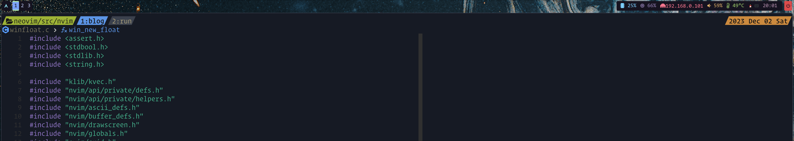

## Introduction

Usually I use neovim and tmux in kitty terminal. Currently I use archlinux + hyprland + waybar.
There are many status bars on my monitor. `neovim statusline and tabline`, tmux bar waybar. They
overlap in many places and take up my screen space. So I decided to remove some status bars. They
are distracting me. I think I can focus on writing code. And I'm tired of those status bars with
graphical symbols. So I tried to do some integration.

## Integration

Normally I don't use neovim `tabline` (also lots of pepole call bufferline) that mean i don't
set `set tabline=2` in my neovim config. my workflow is `winbar` + my personal plugin flybuf to
switch buffer. But sometimes I need to see the full name of a file. So I'm going to use tmux's bar
as my bufferline. it have many spaces.

### Tmux Settings

Okay first need put tmux bar to top by set `set -g status-position top`. If you doesn't see the bar
make sure you set `set -g status on`. and I need the active pane information also in left. just set
`status-justify` to left.

```text
set -g status-interval 1
set -g status on
set -g status-justify left
set -g status-position top
```

notice `status-interval` set to `1` make tmux bar update quickly.

now need config a tmux bar:

```text
prefix="#{?client_prefix,🐠,}"
set -g status-left "#[fg=green]#[fg=black,bg=green] #{?@path,#{@path},#{s|$HOME/||:pane_current_path}}#[bg=$background,fg=green]"
set -g status-right "$prefix #[fg=yellow]#[bg=yellow,fg=black,bold]%Y %b %d %a#[bg=$background,fg=yellow]"
set -g window-status-format "#[fg=$inactive]#[bg=$inactive,fg=colour7]#I:#W#[fg=$inactive,bg=$background]"
set -g window-status-current-format "#[fg=blue]#[bg=blue,fg=black,bold]#I:#W#[fg=blue,bg=$background]"
set -g window-status-separator ''
```

**Need nerd font install OR Config symbol map in kitty**

### Neovim Lua Code

now let neovim control tmux bar to show file name.

```lua
local function set_tmux_bar()
  vim.defer_fn(function()
    local fname = api.nvim_buf_get_name(0)
    if #fname == 0 then
      return
    end
    local parts = vim.split(fname, '/', { trimempty = true })
    -- remove /home/xx/workspace and folder/filename
    -- because i set winbar to show file name and up folder in winbar
    parts = { unpack(parts, (parts[3] == 'workspace' and 4 or 3), #parts - 1) }
    fname = table.concat(parts, '/')
    vim.system({ 'tmux', 'set', '@path', fname }, { text = true }, function(obj)
      if obj.stderr then
        print(obj.stderr)
      end
    end)
  end, 0)
end
```

why wrap in `defer_fn`. actually `defer_fn` just a luv (libuv lua wrap) timer wrapper. when timeout
is `0` it will run in next `event loop`. because doesn't have a high priority for me. the
callbacks in current event loop make more sense for me. So I run it in next event loop. there just 
show file folder in tmux bar the tail and home is removed. because i show filename in neovim winbar.

the core of these codes just `tmux set @path`. this is tmux script formats. you can take more
information about this format on tmux wiki page. in tmux I config the left like

```text
set -g status-left "#[fg=green]#[fg=black,bg=green] #{?@path,#{@path},#{s|$HOME/||:pane_current_path}}#[bg=$background,fg=green]"
```

let me explain this code. when neovim not running `@path` is empty then tmux bar will show current 
pane path `{:pane_current_path}`. this will show a full path which have host name. Usually i don't
want see it. replace `#{s|$HOME/||:pane_current_path}` when path have `$HOME` will sub to empty.

```lua
local au = vim.api.nvim_create_autocmd

au('VimLeave', {
  group = my_group,
  callback = function()
    vim.system({ 'tmux', 'set', '@path', '0' }, { text = true }, function() end)
  end,
})

au('BufEnter', {
  group = my_group,
  callback = function()
    if vim.fn.getenv('TMUX') == 1 then
      return
    end
    set_tmux_bar()

    if #api.nvim_get_autocmds({ group = my_group, event = { 'FocusGained' } }) == 0 then
      au('FocusGained', {
        group = my_group,
        callback = function()
          set_tmux_bar()
        end,
      })
    end
  end,
})
```

nkNeed some events to trigger update. First is `BufEnter`. when a buffer open update the tmxu bar.
when exit neovim also need update tmux bar to current path so just set `@path` to `0`. Next is
`FocusGained` sometimes I will split a tmux window to run neovim do some test or some other works.
Also need update tmux bar.

Now everything works perfect.
