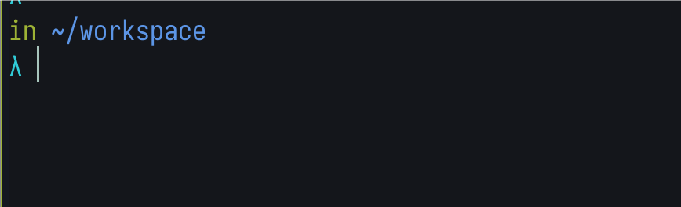
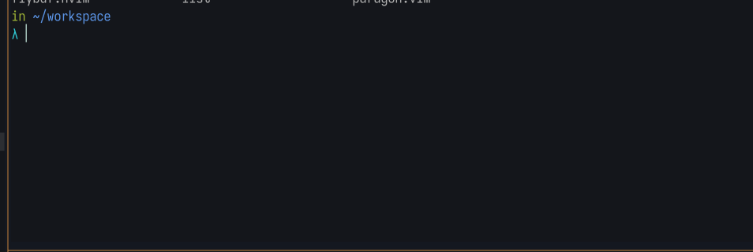

# Why Not Use P10k

P10k is a fantastic asynchronous Zsh prompt plugin. It is fast, the author is
very active, and it provides convenient customization commands, allowing you to
easily generate a Zsh prompt you like. However, when you look at the content of
the generated file, it is enormous. This is because the author has provided support
for many aspects, such as displaying different language environments, language
versions, Git information, prompt formatting, styles, custom function hooks, etc.
This is the path a plugin should take to meet the needs of most people. However,
I usually don't use so many features. I once generated a minimal pure theme based
on P10k. One day, while organizing my dotfiles, I wanted to modify some styles.
But even with the minimal pure theme style, P10k still generated hundreds of lines
of shell code. So I decided to get rid of it.

# Synchronous Zsh Prompt

Writing a simple Zsh theme is easy. First, define some color variables, such
as `RED="%F{red}"`. Then, create a simple function to generate the desired prompt
string and pass it to the `PROMPT` variable.

```sh
# Function to get current directory and Git branch
prompt_info() {
  local cwd git_branch
  cwd=$(pwd | sed "s|$HOME|~|")

  if git rev-parse --is-inside-work-tree &> /dev/null; then
    git_branch=$(git rev-parse --abbrev-ref HEAD)
    git_commit=$(git rev-parse --short HEAD)
    echo "${GREEN}in ${BLUE}$cwd ${YELLOW}$git_branch ${MAGENTA}$git_commit${RESET}"
  else
    echo "${GREEN}in ${BLUE}$cwd${RESET}"
  fi
}
```

This is simple: when working within a Git project, it gets the branch and commit
information and outputs it via `echo`. Then, wrap this in an `update_prompt`
function and call it in `.zshrc` file, finally appending it to `precmd_functions`.
Everything is done.

```sh
# Function to update the prompt
update_prompt() {
  PROMPT="$(prompt_info)
${CYAN}λ ${RESET}"
}
```

I like to have the input on the second line, so I use a newline in the `PROMPT`
format string.



# Asynchronous Implementation

When working on a PR in Vim, I wanted to see some commit information, so I tried
adding commit info to the `prompt_info` function. Then, when I opened a new shell,
it was as slow as a turtle. This is why asynchronous P10k is the best among all
Zsh themes. So I tried to get Git information asynchronously and update the
`PROMPT` using Zsh's asynchronous jobs.



## Function to Get Git Status

```sh
# Function to get Git status
prompt_git_status() {
  git rev-parse --git-dir >&- 2>&- || {
    echo -n $'\0'
    return
  }

  local -a parts
  local fd line head ahead behind conflicts staged changed untracked commithash

  exec {fd}< <(git status --porcelain=v2 --branch)

  while read -A -u $fd line; do
    case "$line" in
      '# branch.oid'*)
        if [[ "${line[3]}" != "(initial)" ]]; then
          commit_hash="${line[3]:0:7}"
        fi
        ;;
      '# branch.head'*) # Current branch
        head="$line[3]"
        [[ $head == "(detached)" ]] && head="$(echo ":$(git rev-parse --short HEAD)")"
        ;;
      '# branch.ab'*) # Divergence from upstream
        ahead="${line[3]/#+}"
        behind="${line[4]/#-}"
        ;;
      (1|2)*) # Modified or renamed/copied
        [[ "${${line[2]}[1]}" != "." ]] && ((staged++))
        [[ "${${line[2]}[2]}" != "." ]] && ((changed++))
        ;;
      'u'*) # Unmerged
        ((conflicts++))
        ;;
      '?'*) # Untracked
        ((untracked++))
        ;;
    esac
  done

  exec {fd}<&-

  parts+="%F{8}$head%f"
  if [[ -n "$commit_hash" ]]; then
    parts+="%F{magenta}$commit_hash%f"
  fi
  local -a upstream_divergence

  [[ $ahead > 0 ]] && upstream_divergence+="%F{blue}↑$ahead%f"
  [[ $behind > 0 ]] && upstream_divergence+="%F{blue}↓$behind%f"

  if [[ $#upstream_divergence > 0 ]]; then
    parts+="${(j::)upstream_divergence}"
  fi

  local -a working_info

  [[ $conflicts > 0 ]] && working_info+="%F{red}×$conflicts%f"
  [[ $staged > 0 ]] && working_info+="%F{green}●$staged%f"
  [[ $changed > 0 ]] && working_info+="%F{208}✻$changed%f"
  [[ $untracked > 0 ]] && working_info+="%F{red}+$untracked%f"

  if [[ $#working_info > 0 ]]; then
    parts+="${(j::)working_info}"
  else
    parts+="%F{green}✔%f"
  fi

  echo -n "${(j: :)parts}"
}
```

The prompt_git_status function asynchronously fetches the Git status and details
for the current repository. It uses the `git status --porcelain=v2 --branch`
command to retrieve information about the repository. Here's what each part of
the function does:

1. Initial Check: Verifies if the current directory is a Git repository.
   If not, it returns early with a null character.

2. Variables and File Descriptors: Initializes necessary variables and opens a
   file descriptor to read the Git status output.

3. Parsing Git Status: Iterates over each line of the Git status output, parsing
   various details such as the branch name, commit hash, upstream divergence,
   and file changes (staged, modified, untracked, and conflicts).

4. Output Construction: Constructs the prompt output based on the parsed Git status.

## Function to Define the Prompt

```sh
# Function to define the prompt
prompt_git_define_prompt() {
  setopt localoptions extendedglob

  local -a parts=()

  # Abbreviated current working directory
  parts+="%F{green}in %F{blue}${${PWD/#$HOME/~}}%f"

  # Git info (loaded async)
  if [[ "$1" != $'\0' ]]; then
    if [[ -n "$1" ]]; then
      parts+="$1"
    else
      parts+="..."
    fi
  fi

  # Prompt arrow (red for non-zero status)
  parts+="%(?.%F{8}.%F{red})
%F{cyan}λ%f"

  PROMPT="${(j: :)parts} "
}
```

1. Abbreviated Current Directory: Shortens the current working
   directory path, replacing the home directory with ~.

2. Git Information: If available, appends Git status information to the prompt.

3. Prompt Arrow: Adds the prompt arrow, which changes color based on
   the previous command's exit status.

4. Setting PROMPT: Combines all parts and sets the `PROMPT` variable.

## Function to Handle Async Response

```sh
# Function to handle async response
prompt_git_response() {
  typeset -g _prompt_git_fd

  prompt_git_define_prompt "$(<&$1)"
  zle reset-prompt

  zle -F $1
  exec {1}<&-
  unset _prompt_git_fd
}
```

This function handles the asynchronous response from the Git status
command:

1. Reads Response: Reads the Git status from the file descriptor.

2. Defines Prompt: Calls prompt_git_define_prompt with the Git
   status information.

3. Resets Prompt: Uses zle reset-prompt to update the prompt.

## Function to Run Before Each Prompt

```sh
# Function to run before each prompt
prompt_git_precmd() {
  typeset -g _prompt_git_fd

  prompt_git_define_prompt

  [[ -n $_prompt_git_fd ]] && {
    zle -F $_prompt_git_fd
    exec {_prompt_git_fd}<&-
  }

  exec {_prompt_git_fd}< <(prompt_git_status)
  zle -F $_prompt_git_fd prompt_git_response
}
```

in the end need add into zsh hook

```sh
# Add hook to run before each prompt
add-zsh-hook precmd prompt_git_precmd
```

The `add-zsh-hook precmd prompt_git_precmd` command adds the
`prompt_git_precmd` function to the list of functions that are run
before each prompt. This ensures that the prompt is updated with the
latest Git status information every time a new prompt is displayed.
